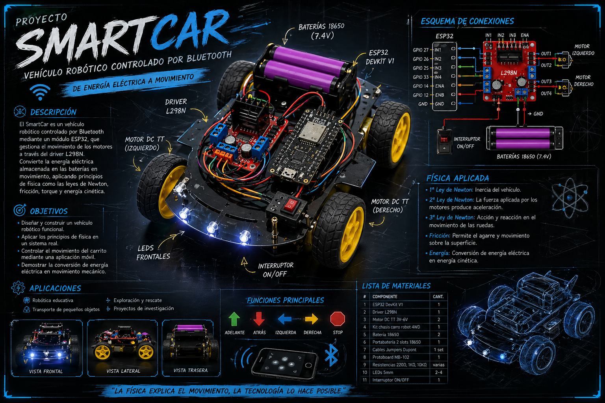
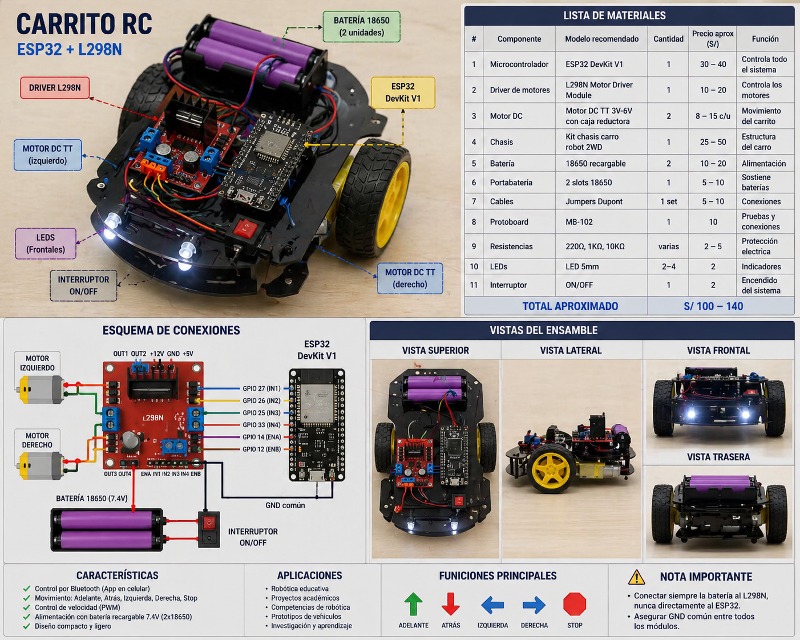
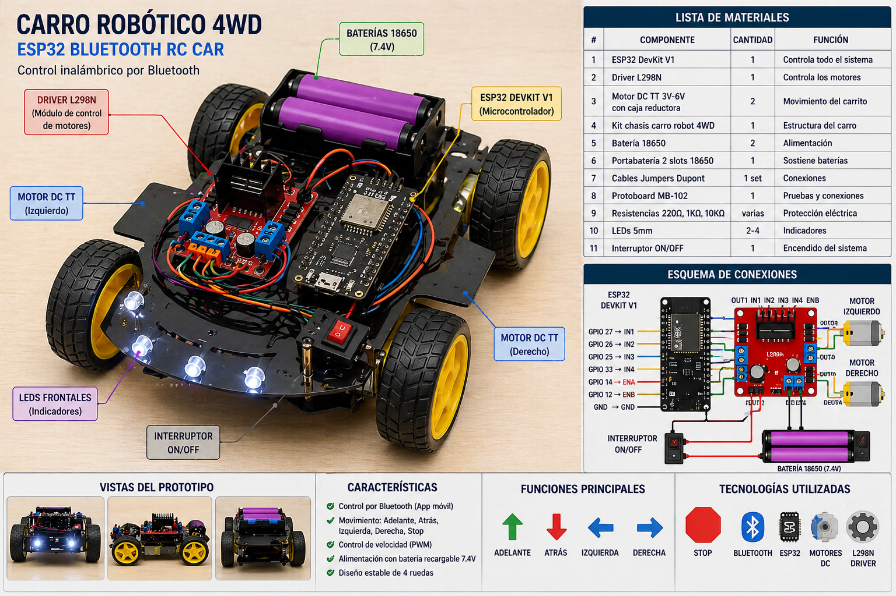

# 🚗 ESP32 Robot Car — Vehículo Robótico con Control Bluetooth


> *"La física explica el movimiento, la tecnología lo hace posible."*

## 🎥 Demo del proyecto

[](https://youtu.be/YWnTYl4Br-E)

## 📌 Descripción

Este proyecto consiste en el diseño y construcción de un **vehículo robótico controlado de forma remota mediante Bluetooth**, utilizando un microcontrolador **ESP32** y un driver de motores **L298N**.

El sistema permite controlar el movimiento del vehículo en tiempo real desde una aplicación móvil, convirtiendo energía eléctrica en energía mecánica a través de motores DC con caja reductora.

---

## 🎯 Objetivos

- Diseñar y construir un vehículo robótico funcional (2WD y 4WD)
- Aplicar principios de física: movimiento, fuerza y conversión de energía
- Implementar comunicación inalámbrica mediante Bluetooth clásico (SPP)
- Analizar el comportamiento del sistema bajo distintas condiciones de carga y superficie

---

## 🖼️ Vista previa

| Presentación | Versión 2 ruedas | Versión 4 ruedas |
|:---:|:---:|:---:|
|  |  |  |
---
<video src="assets/videos/ESP32.mp4" controls width="600"></video>
## 👥 Integrantes

| Nombre | Rol |
|---|---|
| Gonzales Perez, Alexis Noe | Programación y electrónica |
| Lopez Guimnees, Favio Rafael | Ensamblaje y pruebas |
| Majuan Vusatmante, Victor Daniel | Documentación y diseño |

---

## 📂 Estructura del proyecto

```
├── README.md
├── code/
│   └── esp32.c
├── assets/
│   ├── images/
│   │   ├── presentacion.png
│   │   ├── 2_ruedas.png
│   │   ├── 4_ruedas.png
│   │   └── diagrama.png
│   └── videos/
│       └── demo.mp4
│
├── diagrams/
│   └── conexiones.png            ← Esquema de conexiones
│
└── docs/
    └── informe.pdf               ← Informe técnico completo
```

---

## 🛠️ Lista de materiales

| N° | Componente | Especificación | Cant. | Costo aprox. (S/) |
|:--:|---|---|:--:|:--:|
| 1 | Microcontrolador | ESP32 DevKit V1 | 1 | 30 – 40 |
| 2 | Driver de motores | L298N | 1 | 10 – 20 |
| 3 | Motor DC | TT 3V–6V con reductora | 2–4 | 8 – 15 c/u |
| 4 | Chasis | Kit 2WD / 4WD | 1 | 25 – 50 |
| 5 | Batería | Li-Ion 18650 recargable | 2 | 10 – 20 |
| 6 | Portabatería | 2 slots serie | 1 | 5 – 10 |
| 7 | Cables | Jumpers Dupont M-M / M-H | 1 set | 5 – 10 |
| 8 | Protoboard | MB-102 | 1 | 10 |
| 9 | Resistencias | 220Ω, 1KΩ, 10KΩ | varias | 2 – 5 |
| 10 | LEDs | 5mm (rojo / verde) | 2 – 4 | 2 |
| 11 | Interruptor | ON/OFF | 1 | 2 |
| | | | **Total estimado** | **~S/ 120 – 185** |

---

## 🔌 Diagrama de conexiones

```
ESP32 GPIO 27 ──────► IN1  (L298N)   Motor A - dirección
ESP32 GPIO 26 ──────► IN2  (L298N)   Motor A - dirección
ESP32 GPIO 25 ──────► IN3  (L298N)   Motor B - dirección
ESP32 GPIO 33 ──────► IN4  (L298N)   Motor B - dirección
ESP32 GPIO 14 ──────► ENA  (L298N)   Motor A - velocidad (PWM)
ESP32 GPIO 12 ──────► ENB  (L298N)   Motor B - velocidad (PWM)
GND           ──────► GND  (común)
```

> 📎 Ver diagrama visual completo en


---

## ⚙️ Esquema de montaje

```
   [ RUEDA ]              [ RUEDA ]
       |                      |
    Motor L               Motor R
       \                      /
        \                    /
    ┌────────────────────────┐
    │        C H A S I S     │
    │                        │
    │    ┌──────────────┐    │
    │    │    ESP32     │    │
    │    └──────────────┘    │
    │    ┌──────────────┐    │
    │    │    L298N     │    │
    │    └──────────────┘    │
    │    ┌──────────────┐    │
    │    │  BATERÍA 2x  │    │
    │    │    18650     │    │
    │    └──────────────┘    │
    └────────────────────────┘
       |                      |
   [ RUEDA ]              [ RUEDA ]
```

---

## ⚡ Funcionamiento

```
┌──────────────┐   Bluetooth   ┌─────────┐   GPIO signals   ┌────────┐   PWM   ┌────────────┐
│  App Móvil   │ ────────────► │  ESP32  │ ───────────────► │ L298N  │ ──────► │  Motores   │
│  (F/B/L/R/S) │               │         │                  │        │         │  DC x2–4   │
└──────────────┘               └─────────┘                  └────────┘         └────────────┘
```

El ESP32 recibe comandos por Bluetooth (perfil SPP) y activa las combinaciones de pines correspondientes en el driver L298N para girar los motores en la dirección deseada.

---

## 📱 Comandos de control

| Comando | Acción | Motores |
|:---:|---|---|
| `F` | Adelante | A y B hacia adelante |
| `B` | Atrás | A y B hacia atrás |
| `L` | Izquierda | Motor A adelante, B atrás |
| `R` | Derecha | Motor B adelante, A atrás |
| `S` | Detener | Ambos apagados |

**Aplicaciones recomendadas:** *Bluetooth RC Controller*, *Serial Bluetooth Terminal* (Android)

---

## 🧠 Física aplicada

**Segunda Ley de Newton (F = m·a)**
La fuerza generada por los motores DC determina la aceleración del vehículo según su masa total.

**Fricción estática y cinética**
La adherencia de las ruedas al suelo permite el desplazamiento; superficies con mayor rugosidad incrementan la tracción.

**Conversión de energía**
La energía química de las baterías 18650 se convierte en energía eléctrica, y esta en energía mecánica rotacional a través del motor.

**Torque y reductora**
La caja reductora de los motores TT aumenta el torque disponible a expensas de la velocidad máxima, mejorando la capacidad de carga del vehículo.

---

## 🚀 Resultados esperados

- ✅ Movimiento estable y controlado en las 4 direcciones
- ✅ Respuesta en tiempo real (latencia < 100 ms vía Bluetooth)
- ✅ Autonomía mínima de 30–60 min con baterías 18650 cargadas
- ✅ Sistema funcional, ordenado y reproducible

---

## 📋 Notas técnicas

> ⚠️ **Alimentación:** El L298N requiere una fuente separada para los motores (7–12V). No alimentar los motores directamente desde el ESP32.

> ⚠️ **Conexiones:** Verificar polaridad de los motores antes de encender. Invertir un par de cables cambia el sentido de giro.

> ✅ **Orden del cableado:** Usar colores distintos para VCC (rojo), GND (negro) y señales (otros) facilita el diagnóstico de fallas.

---

## 📄 Licencia

Este proyecto está bajo la licencia [MIT](LICENSE). Libre para usar, modificar y distribuir con atribución.
