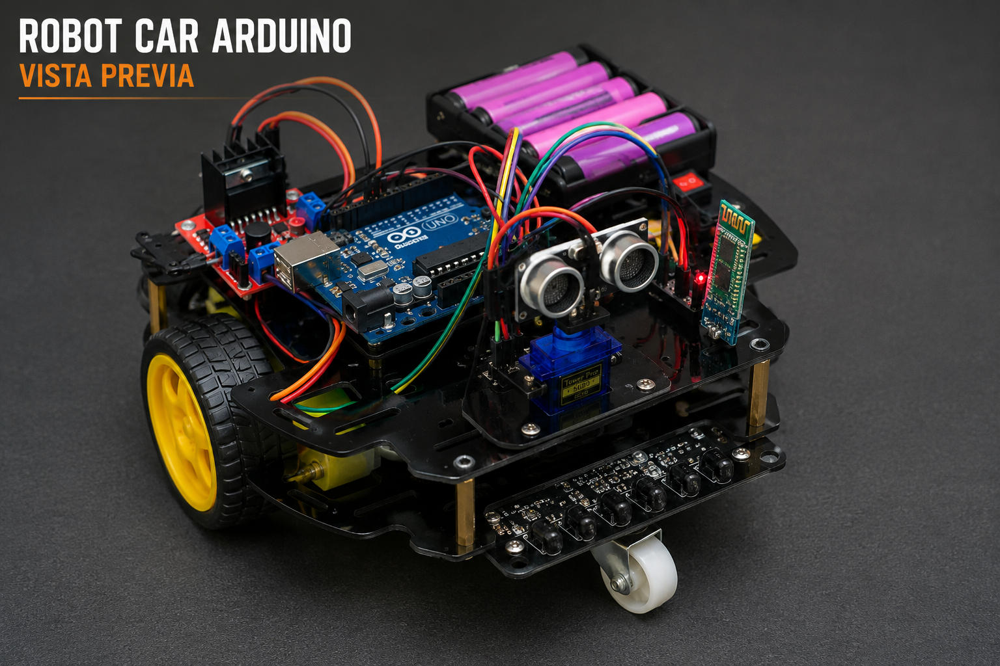

# 🤖 Robot Car Arduino

[](LICENSE)
[](https://www.arduino.cc/)
[](https://en.wikipedia.org/wiki/C%2B%2B)
[](#-roadmap)

**An autonomous 2WD robot platform for embedded systems experimentation, featuring modular architecture, intelligent navigation, and real-time telemetry.**

<p align="center">
  
</p>

---

## 📋 Table of Contents

- [🤖 Robot Car Arduino](#-robot-car-arduino)
  - [📋 Table of Contents](#-table-of-contents)
  - [✨ Overview](#-overview)
  - [🎯 Key Features](#-key-features)
  - [⚙️ Hardware](#️-hardware)
  - [🏗️ Architecture](#️-architecture)
    - [🧠 Core Layer](#-core-layer)
    - [🔌 Drivers Layer](#-drivers-layer)
    - [🎮 Features Layer](#-features-layer)
  - [📁 Repository Structure](#-repository-structure)
  - [📚 Documentation](#-documentation)
  - [🗺️ Roadmap](#️-roadmap)
  - [🤝 Contributing](#-contributing)
    - [📋 Requerimientos mínimos](#-requerimientos-mínimos)
  - [📄 License](#-license)
  - [📞 Contact \& Support](#-contact--support)
    - [⭐ Si este proyecto te resultó útil, considera darle una estrella!](#-si-este-proyecto-te-resultó-útil-considera-darle-una-estrella)

---

## ✨ Overview

Robot Car Arduino es una plataforma robótica móvil de código abierto diseñada para exploración, aprendizaje y prototipado rápido con sistemas embebidos.

El proyecto implementa una **arquitectura modular y escalable** que separa claramente la lógica de negocio, los controladores de hardware y las funcionalidades de alto nivel del robot, permitiendo:

- 🔧 **Mantenimiento simplificado**
- 📈 **Escalabilidad** a nuevas funcionalidades
- 🔄 **Reutilización de código**
- 📚 **Aprendizaje estructurado**

---

## 🎯 Key Features

| Feature | Status | Description |
|---------|--------|-------------|
| **Manual Control** | ✅ Implemented | Control remoto vía Bluetooth desde aplicación móvil |
| **Obstacle Avoidance** | ✅ Implemented | Detección y evasión autónoma de obstáculos |
| **Line Following** | ✅ Implemented | Seguimiento de línea con sensores IR y corrección automática |
| **Autonomous Navigation** | ✅ Implemented | Navegación completamente autónoma con toma de decisiones |
| **Telemetry System** | ✅ Implemented | Monitoreo en tiempo real de estado, velocidad y sensores |
| **Bluetooth Communication** | ✅ Implemented | Control y telemetría inalámbrica |
| **WiFi Connectivity** | 🔄 Planned | Expansión futura con ESP32 |

---

## ⚙️ Hardware

<details>
<summary><b>Componentes principales (click para expandir)</b></summary>

| Component | Model | Purpose |
|-----------|-------|---------|
| **Microcontroller** | Arduino UNO | Cerebro principal del sistema |
| **Motor Driver** | L298N | Control de motores DC |
| **Distance Sensor** | HC-SR04 | Detección de obstáculos ultrasónica |
| **Servo Motor** | SG90 | Escaneo del entorno |
| **Line Sensors** | IR Sensors | Seguimiento de línea |
| **Motors** | DC Gear Motors | Movimiento de ruedas (2WD) |
| **Wireless** | Bluetooth Module | Comunicación remota |
| **Power** | Batería 5V/6V | Alimentación del sistema |

</details>

---

## 🏗️ Architecture

Robot Car Arduino utiliza una **arquitectura modular de 5 capas** para máxima flexibilidad y reutilización:

<details>
<summary><b>Estructura de módulos (click para expandir)</b></summary>

```
📦 Robot Car Arduino
│
├── 🧠 Core (Lógica Central)
│   ├── RobotController      → Coordinador principal
│   ├── StateMachine         → Gestión de estados
│   └── EventManager         → Sistema de eventos interno
│
├── 🔌 Drivers (Acceso a Hardware)
│   ├── MotorDriver          → Control de motores DC
│   ├── UltrasonicDriver     → Sensor de distancia HC-SR04
│   ├── ServoDriver          → Control de servomotor SG90
│   └── EncoderDriver        → Lectura de encoders
│
├── 🎮 Features (Funcionalidades)
│   ├── ObstacleAvoidance    → Evasión autónoma de obstáculos
│   ├── LineFollower         → Seguimiento de línea automático
│   ├── ManualControl        → Control remoto manual
│   └── AutonomousMode       → Navegación completamente autónoma
│
├── 📡 Communication (Comunicación Externa)
│   ├── Bluetooth            → Comunicación inalámbrica actual
│   ├── WiFi (Future)        → Expansión futura con ESP32
│   └── Telemetry            → Sistema de monitoreo
│
└── ⚙️ Config (Configuración)
    ├── Pin Definitions      → Mapeo de pines
    ├── System Constants     → Constantes del sistema
    ├── Sensor Thresholds    → Umbrales de sensores
    └── Navigation Params    → Parámetros de navegación
```

### 🧠 Core Layer

| Component | Responsibility |
|-----------|----------------|
| **RobotController** | Inicializa componentes, coordina ciclo principal |
| **StateMachine** | Gestiona: Idle, Manual, Obstacle Avoidance, Line Following, Autonomous |
| **EventManager** | Propaga eventos: ObstacleDetected, LineLost, BluetoothConnected, ModeChanged |

### 🔌 Drivers Layer

Abstracción de hardware con interfaces consistentes:

- **MotorDriver**: Forward, Backward, Left, Right, Stop, Speed Control
- **UltrasonicDriver**: Medición de distancia, Detección de obstáculos
- **ServoDriver**: Movimiento angular, Escaneo del entorno
- **EncoderDriver**: Velocidad, Distancia, Retroalimentación

### 🎮 Features Layer

Comportamientos de alto nivel que utilizan la capa de Drivers:

- **ObstacleAvoidance**: Escaneo frontal → Detección → Selección de ruta
- **LineFollower**: Lectura IR → Corrección automática de trayectoria
- **ManualControl**: Movimiento manual, Control de velocidad, Comandos remotos
- **AutonomousMode**: Navegación automática, Integración de sensores, Toma de decisiones

</details>

---

## 📁 Repository Structure

```
├── 🧠 Core/                    # Lógica central del robot
│   ├── RobotController/
│   ├── StateMachine/
│   └── EventManager/
│
├── 🔌 Drivers/                 # Capa de acceso a hardware
│   ├── MotorDriver/
│   ├── UltrasonicDriver/
│   ├── ServoDriver/
│   └── EncoderDriver/
│
├── 🎮 Features/                # Funcionalidades de alto nivel
│   ├── ObstacleAvoidance/
│   ├── LineFollower/
│   ├── ManualControl/
│   └── AutonomousMode/
│
├── 📡 Communication/           # Sistemas de comunicación
│   ├── Bluetooth/
│   ├── Telemetry/
│   └── WiFi/
│
├── ⚙️ Config/                  # Configuración global
│   ├── PinDefinitions.h
│   ├── Constants.h
│   └── Thresholds.h
│
├── 📚 docs/                    # Documentación completa
│   ├── architecture.md         # Detalles de arquitectura
│   ├── hardware.md             # Especificaciones de hardware
│   ├── wiring.md               # Diagramas de conexión
│   ├── testing.md              # Protocolo de testing
│   ├── structure.md            # Detalles de estructura
│   └── roadmap.md              # Plan de desarrollo
│
├── 🧪 tests/                   # Casos de prueba
│   └── README.md
│
├── 📊 schematics/              # Esquemas eléctricos
│   └── README.md
│
├── 🖼️ assets/                  # Recursos multimedia
│   ├── images/                 # Fotografías y diagramas
│   ├── videos/                 # Demostraciones
│   └── audio/                  # Sonidos y alarmas
│
├── 📄 README.md                # Este archivo
├── 📋 CHANGELOG.md             # Historial de cambios
├── 🤝 CONTRIBUTING.md          # Guía de contribución
├── 📜 LICENSE                  # MIT License
└── .gitignore
```

---

## 📚 Documentation

Documentación completa disponible en el directorio `docs/`:

| Document | Purpose |
|----------|---------|
| [**architecture.md**](docs/architecture.md) | 🏗️ Detalles técnicos de la arquitectura y diseño |
| [**hardware.md**](docs/hardware.md) | ⚙️ Especificaciones de componentes y características |
| [**wiring.md**](docs/wiring.md) | 🔌 Diagramas de conexión y mapeo de pines |
| [**testing.md**](docs/testing.md) | 🧪 Protocolo de testing y validación |
| [**structure.md**](docs/structure.md) | 📁 Guía detallada de la estructura del proyecto |
| [**roadmap.md**](docs/roadmap.md) | 🗺️ Plan de desarrollo y futuras características |

---

## 🗺️ Roadmap

```
v1.0 ✅
├── Platform base de Arduino UNO
├── Control Bluetooth
└── Detección de obstáculos

v1.1 ✅
├── Sistema de evasión de obstáculos
└── Escaneo con servo

v1.2 ✅
└── Sistema de seguimiento de línea

v2.0 🔄 (Próximo)
├── Arquitectura mejorada
├── Gestión avanzada de estados
└── Sistema de telemetría completo

v3.0 🔮 (Futuro)
├── Migración a ESP32
├── Conectividad WiFi
└── Dashboard web

v4.0 🚀 (Visión)
├── Integración de cámara
├── Visión por computadora
└── Navegación inteligente
```

---

## 🤝 Contributing

¡Las contribuciones son bienvenidas! Para contribuir al proyecto:

1. **Fork** el repositorio
2. **Crea una rama** (`git checkout -b feature/AmazingFeature`)
3. **Commitea tus cambios** (`git commit -m 'Add some AmazingFeature'`)
4. **Push a la rama** (`git push origin feature/AmazingFeature`)
5. **Abre un Pull Request**

Por favor lee [CONTRIBUTING.md](CONTRIBUTING.md) para más detalles sobre nuestro código de conducta y proceso de contribución.

### 📋 Requerimientos mínimos

- Arduino IDE 1.8.x o superior
- Conocimiento básico de C/C++
- Familiaridad con embedded systems

---

## 📄 License

Este proyecto está licenciado bajo la **MIT License** - ver archivo [LICENSE](LICENSE) para más detalles.

**Autores :**
  - Alexis Noe Gonzales Perez
  - Favio Rafael Lopez Jimenes
  - Victor danei Majuan Vustamnet
---

## 📞 Contact & Support

- 📧 Para reportar bugs o sugerir mejoras: [Abre un issue](../../issues)
- 💬 Para discusiones generales: [Discussions](../../discussions)
- 🐛 Encuentra un bug? [Reporta aquí](../../issues/new?labels=bug)

---

<div align="center">

### ⭐ Si este proyecto te resultó útil, considera darle una estrella!

Construido con ❤️ para la comunidad de robótica embebida

</div>
